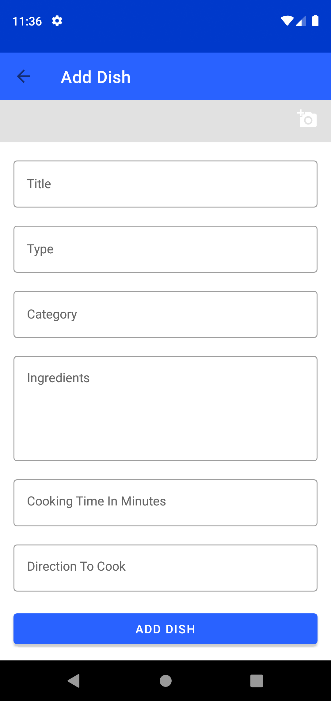
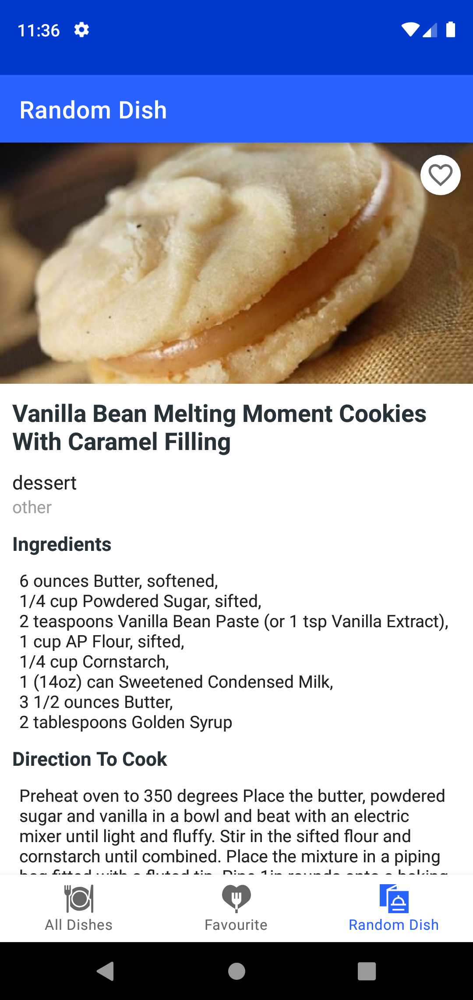
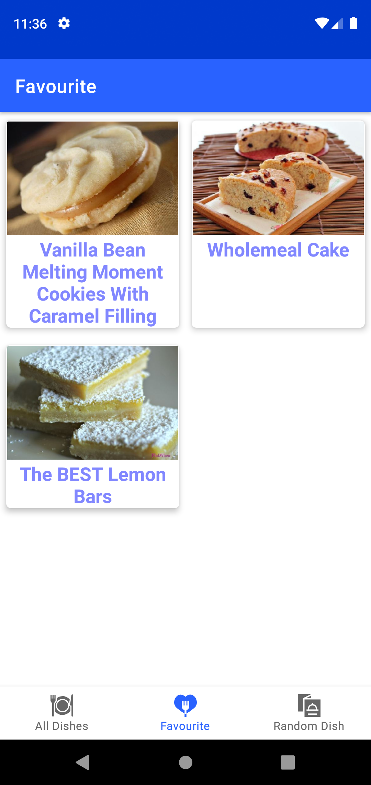

# MyDishApp

My dish app is an application that can create your own favourite dish, or randomly search for a dishes using API services. 
User can also make the dish as favourite dishes.

## Sreenshot

  

## Contributing
Pull requests are welcome. For major changes, please open an issue first to discuss what you would like to change.

Please make sure to update tests as appropriate.

## License
[MIT](https://choosealicense.com/licenses/mit/)
